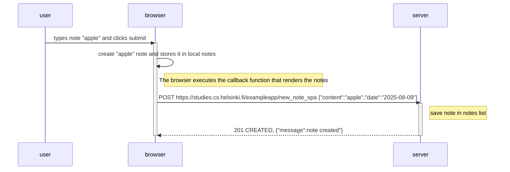

```mermaid
sequenceDiagram
    participant user
    participant browser
    participant server

    user->>browser: types note "apple" and clicks submit
    activate browser
    browser->>browser: create "apple" note and stores it in local notes
    Note right of browser: The browser executes the callback function that renders the notes

    browser->>server: POST https://studies.cs.helsinki.fi/exampleapp/new_note_spa {"content":"apple","date":"2025-08-09"}
    activate server
    Note right of server:save note in notes list
    server-->>browser: 201 CREATED, {"message":note created"}
    deactivate server
    deactivate browser
```